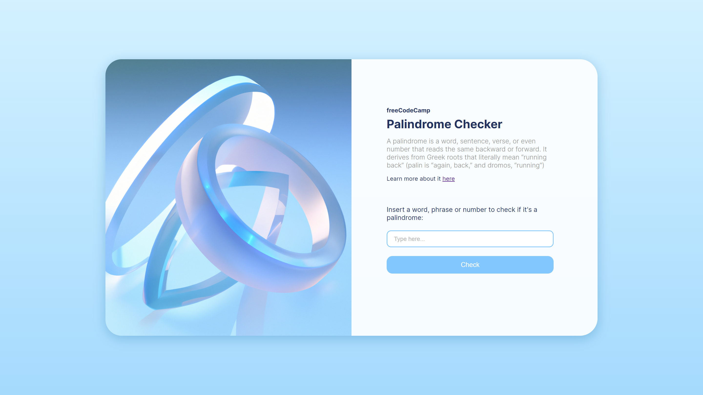

# 

 
 

This Palindrome Checker project was created as a certification requirement for the JavaScript Algorithms and Data Structures course from freeCodeCamp. The objective was to develop an application that checks whether a given word or phrase is a palindrome. The app fulfills the required functionalities, providing a user-friendly interface to input text and receive instant feedback on whether the text is a palindrome or not.

> [!IMPORTANT]
> This project is part of the freeCodeCamp JavaScript Algorithms and Data Structures course. Although freeCodeCamp provides guidelines and user stories for certification projects, it does not offer tutorials or step-by-step guides for development. This project was built entirely from scratch using my own approach to meet the requirements.

 Screenshot

  

    

## 📝 Project Objective

The primary objective of this project was to create a palindrome checker application similar to the provided example. The goal was to implement a functional and interactive app that checks whether a given word or phrase reads the same forwards and backwards. The design and functionality of the app reflect personal choices while sticking to the user stories provided.

## 🔧 Features

- **Input Field**: An `input` element with id `text-input` for users to enter text.

- **Check Button**: A `button` element with id `check-btn` that triggers the palindrome check.

- **Result Display**: A `span` element with id `result` that shows whether the entered text is a palindrome or not.

- **Validation and Alerts**: If the input field is empty, an alert message ("Please input a value") appears, and the UI elements are styled accordingly.

- **Palindrome Checking**: The application uses JavaScript to strip non-alphanumeric characters and compare the cleaned input against its reversed version.

- **Styling Feedback**: Visual feedback is provided based on the result, with different colors for success and failure states.

## 📖 Learnings

- **DOM Manipulation**: Gained experience in using JavaScript to interact with and modify the Document Object Model (DOM).

- **String and Array Methods**: Applied JavaScript string and array methods for text processing and palindrome checking.

- **Regular Expressions**: Utilized regular expressions to remove non-alphanumeric characters from the input.

- **Event Handling**: Implemented event listeners to handle user interactions and trigger appropriate responses.

## 💻 Technologies Used

- **HTML5** for structuring the application.

- **CSS3** for styling and providing visual feedback.

- **JavaScript** for functionality, including DOM manipulation and string processing.

## 💡 Acknowledgments

- **freeCodeCamp**: For providing the project guidelines and user stories that served as the basis for this application.
